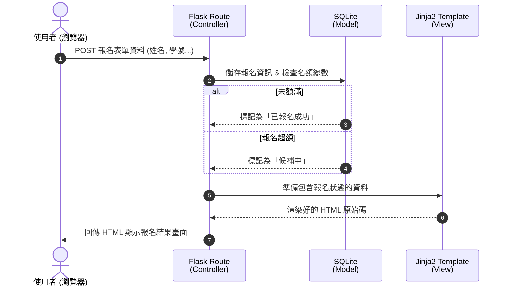

# 系統架構設計文件 (Architecture) - 活動報名系統

## 1. 技術架構說明

根據 PRD 的需求，本專案將採用輕量級且易於維護的技術棧來進行開發。

### 選用技術與原因
- **後端框架：Python + Flask**
  - **原因**：Flask 是一個輕量、靈活的微框架，適合快速開發中小型專案。它沒有過於龐雜的預設設定，能讓開發團隊專注於活動報名、查詢等核心商業邏輯的實作。
- **模板引擎：Jinja2**
  - **原因**：此專案未採用前後端分離，因此直接使用 Flask 內建支援的 Jinja2 引擎來渲染 HTML 網頁。可以快速將後端的活動資料嵌入頁面中呈現給使用者，開發速度快且簡單。
- **資料庫：SQLite**
  - **原因**：SQLite 不需額外安裝或維護單獨的資料庫伺服器，資料會直接存在單一檔案中（適合初期的 MVP 目標）。對於一般的活動報名系統（人數通常在幾百到千人以內規模）來說，效能綽綽有餘。

### Flask MVC 模式說明
雖然 Flask 本身是無預設架構的框架，但本專案將採用類似 MVC（Model-View-Controller）的分層模式來組織程式碼：
- **Model（模型）**：負責系統核心資料的讀寫與商業邏輯判斷，比如檢查報名人數是否額滿、寫入 SQLite 查詢等。
- **View（視圖）**：負責呈現畫面與互動介面，對應到存放於 `templates/` 內的 Jinja2 HTML 檔以及 CSS/JS 靜態資源。
- **Controller（控制器）**：擔任溝通橋樑，對應到 Flask 的路由 (Routes)。負責接收使用者從瀏覽器傳來的 HTTP 請求（例如：送出報名表、查詢）、呼叫 Model 處理，再回傳指定的 View 給使用者。

---

## 2. 專案資料夾結構

為了讓整個系統條理分明，我們規劃了以下目錄結構：

```text
event_system/
│
├── app/                  ← 核心應用程式程式碼
│   ├── __init__.py       ← 實例化 Flask app，並載入所有配置與套件
│   ├── routes/           ← (Controller) 放置所有路由邏輯
│   │   ├── __init__.py
│   │   ├── admin.py      ← 主辦人功能 (建立活動) 相關路由
│   │   ├── events.py     ← 首頁與活動詳情 相關路由
│   │   └── user.py       ← 使用者報名與狀態查詢 相關路由
│   │
│   ├── models/           ← (Model) 資料庫的定義與操作
│   │   ├── __init__.py
│   │   └── db_models.py  ← 定義 Event (活動) 與 Registration (報名表)
│   │
│   ├── templates/        ← (View) Jinja2 的 HTML 模板檔
│   │   ├── base.html     ← 基礎版型（含導覽列、頁尾），其他頁面皆繼承此檔
│   │   ├── index.html    ← 首頁（活動清單顯示）
│   │   ├── event.html    ← 活動詳細頁面與線上報名表單
│   │   ├── create.html   ← 主辦方：新增活動頁面
│   │   └── search.html   ← 報名進度查詢頁面
│   │
│   └── static/           ← 靜態資源檔案
│       ├── css/
│       │   └── style.css
│       └── js/
│           └── main.js
│
├── instance/             ← 運行時產生的檔案與機密資訊 (不會進 Git)
│   └── database.db       ← SQLite 資料庫儲存檔
│
├── app.py                ← 整個專案的進入點 (Entry Point)，從這裡執行 flask run
├── requirements.txt      ← 紀錄 Python 依賴的套件與版本
└── README.md             ← 專案安裝與執行教學
```

---

## 3. 元件關係圖

以下展示各個元件如何運作（以「報名活動」為例）：



---

## 4. 關鍵設計決策

1. **Jinja2 Server-Side Rendering (伺服器端渲染) 代替前端分離框架**
   - **為什麼選擇它**：因為我們需要最快速度完成 MVP 的開發，而且系統互動主要以「單純的表單提交」為主（非高互動型單頁應用）。使用 Jinja2 能夠減少設定與打包的工時。
2. **採用 Flask Blueprint (藍圖) 切分路由**
   - **為什麼選擇它**：隨著功能擴增，若所有 URL 路由都寫死在 `app.py` 中會難以維護。因此會按模組（主辦人路由區、活動展示區、報名區）分割，未來若想要擴充更容易協作。
3. **候補狀態在資料庫設計的處理方案**
   - **為什麼選擇它**：為了實作「報名額滿自動候補」功能，我們會在活動 (Event) 的 Model 保存 `capacity` (上限名額)。每當使用者寫入新的報名紀錄時，若該活動的已報名人數 < `capacity`，系統即標記該使用者狀態為「成功」；若 $\ge$ `capacity`，直接無縫將其狀態寫為「候補中」。這樣的設計不需要寫複雜的排程腳本，靠這行判斷即可滿足。
