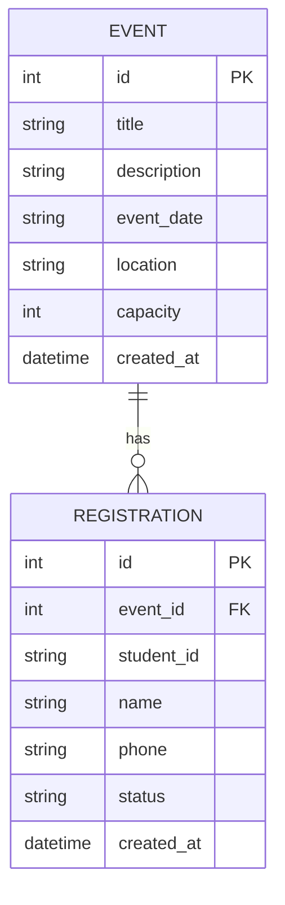

# 資料庫設計文件 (DB Design) - 活動報名系統

## 1. ER 圖（實體關係圖）



## 2. 資料表詳細說明

### EVENT (活動表)
用來儲存主辦方建立的活動資訊。

| 欄位名稱 | 型別 | 屬性 | 說明 |
| :--- | :--- | :--- | :--- |
| id | INTEGER | PK, AUTOINCREMENT | 唯一識別碼 |
| title | TEXT | NOT NULL | 活動名稱 |
| description | TEXT | | 活動內容描述 |
| event_date | TEXT | NOT NULL | 活動時間 (ISO 8601 格式) |
| location | TEXT | NOT NULL | 活動地點 |
| capacity | INTEGER | NOT NULL | 名額限制上限 |
| created_at | TEXT | DEFAULT CURRENT_TIMESTAMP | 建立時間 |

### REGISTRATION (報名表)
用來儲存學生的報名資料，以及報名狀態。

| 欄位名稱 | 型別 | 屬性 | 說明 |
| :--- | :--- | :--- | :--- |
| id | INTEGER | PK, AUTOINCREMENT | 唯一識別碼 |
| event_id | INTEGER | FK | 關聯的活動 ID |
| student_id | TEXT | NOT NULL | 學生學號 |
| name | TEXT | NOT NULL | 學生姓名 |
| phone | TEXT | NOT NULL | 學生連絡電話 |
| status | TEXT | NOT NULL | 報名狀態 (如：'成功', '候補中') |
| created_at | TEXT | DEFAULT CURRENT_TIMESTAMP | 報名時間 |

## 3. SQL 建表語法

請參考 `database/schema.sql`，內容如下：

```sql
CREATE TABLE IF NOT EXISTS event (
    id INTEGER PRIMARY KEY AUTOINCREMENT,
    title TEXT NOT NULL,
    description TEXT,
    event_date TEXT NOT NULL,
    location TEXT NOT NULL,
    capacity INTEGER NOT NULL,
    created_at TEXT DEFAULT CURRENT_TIMESTAMP
);

CREATE TABLE IF NOT EXISTS registration (
    id INTEGER PRIMARY KEY AUTOINCREMENT,
    event_id INTEGER NOT NULL,
    student_id TEXT NOT NULL,
    name TEXT NOT NULL,
    phone TEXT NOT NULL,
    status TEXT NOT NULL,
    created_at TEXT DEFAULT CURRENT_TIMESTAMP,
    FOREIGN KEY (event_id) REFERENCES event (id)
);
```

## 4. Python Model 程式碼

我們使用內建的 `sqlite3` 模組來實作資料庫連線，並符合 `ARCHITECTURE.md` 的規劃，將 Model 置於 `app/models/db_models.py` 中。內含對 `Event` 與 `Registration` 的 CRUD 操作方法。
