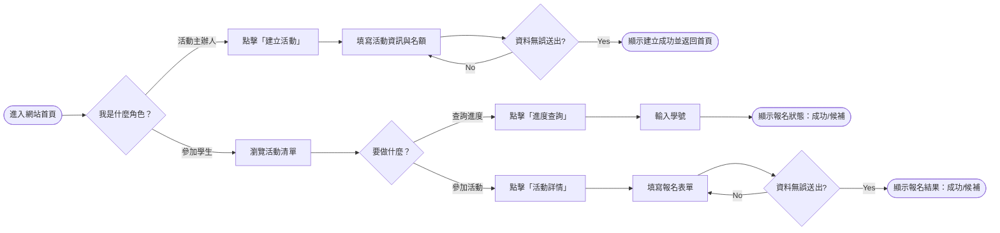
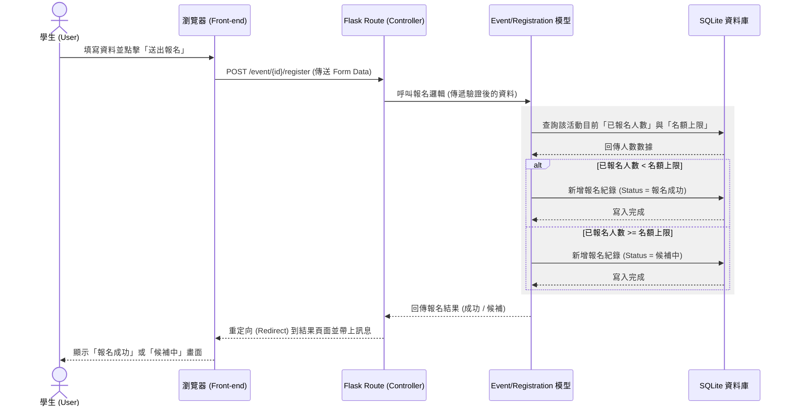

# 流程圖文件 (Flowchart) - 活動報名系統

本文件根據 PRD 與系統架構文件，梳理系統的使用者操作流程、系統背後的資料互動邏輯，並對應到開發時會用到的路徑清單。

## 1. 使用者流程圖 (User Flow)

以下展示兩類主要使用者（**活動主辦人**與**參加學生**）在系統中的操作路徑。

## 2. 系統序列圖 (Sequence Diagram)

以下以最核心的「**學生送出線上報名表**」功能為例，展示前端瀏覽器、Flask 後端與資料庫之間的互動序列與自動候補判斷。

## 3. 功能清單與路徑對照表

總結上述的所有功能操作，並對應到 Flask 的路由設計：

| 功能名稱 | HTTP 方法 | URL 路徑 (Route) | 負責渲染的視圖 (Template) | 說明 |
| :--- | :--- | :--- | :--- | :--- |
| **首頁/活動清單** | `GET` | `/` | `index.html` | 顯示所有開放中與結束的活動 |
| **建立活動專頁 (表單)** | `GET` | `/admin/events/new` | `create.html` | 顯示主辦人建立活動的表單頁面 |
| **送出建立活動** | `POST` | `/admin/events/new` | (Redirect) | 接收主辦人表單資料，寫入資料記錄 |
| **活動詳細內容** | `GET` | `/event/<int:id>` | `event.html` | 顯示特定活動詳細資訊及下方報名表單 |
| **送出活動報名** | `POST` | `/event/<int:id>/register` | (Redirect) | 處理學生報名資料，判定並處理候補邏輯 |
| **報名進度查詢入口** | `GET` | `/status` | `search.html` | 顯示「輸入學號查詢」的頁面 |
| **顯示進度查詢結果** | `POST` 或 `GET` | `/status` | `search.html` | 驗證學號後查詢名下所有報名狀態並顯示在同頁面下方 |
